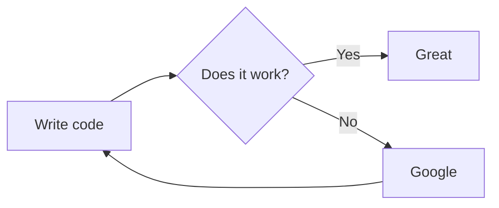

# Markdown
* Markdown là ngôn ngữ đánh dấu giống HTML nhưng đơn giản hơn HTML.
* Markdown dùng để viết văn bản thô, có thể xuất sang HTML với cách đơn giản nhất.
## Table Content <a id="0"></a>
[1. Thẻ, tiêu đề](#1)<br/>
[2. Chỉ mục](#2)<br/>
[3. Gạch đầu dòng](#3)<br/>
[4. Đánh dấu xuống dòng](#4)<br/>
[5. Trích dẫn](#5)<br/>
[6. Highlight](#6)<br/>
[7. Inline code](#7)<br/>
[8. Ký tự in đậm](#8)<br/>
[9. In nghiêng](#9)<br/>
[10. Gạch ngang chữ](#10)<br/>
[11. Gạch ngắt trang](#11)<br/>
[12. Chèn link](#12)<br/>
[13. Chèn ảnh](#13)<br/>
[14. Chèn mỏ neo](#14)<br/>
[15. Tạo bảng](#15)<br/>
[16. Diagram](#16)<br/>
[17. Bonus](#17)<br/>
___
### 1. Thẻ, tiêu đề <a id="1"></a>
[Về đầu trang](#0)<br/>
Markdown sử dụng ký tự `#` để đánh dấu 1 đoạn văn bản là `tiêu đề`.<br/>
Tùy theo số lượng ký tự `#` phía trước ta có số cấp tiêu đề tương ứng.<br/>

Cấp độ tiêu đề hiển thị|Cách viết
----------|----------
Tiêu đề cấp 1|# Tiêu đề cấp 1
Tiêu đề cấp 2|## Tiêu đề cấp 2
Tiêu đề cấp 3|### Tiêu đề cấp 3
Tiêu đề cấp 4|#### Tiêu đề cấp 4
Tiêu đề cấp 5|##### Tiêu đề cấp 5
Tiêu đề cấp 6|###### Tiêu đề cấp 6
___
### 2. Chỉ mục <a id="2"></a>
[Về đầu trang](#0)<br/>
Markdown sử dụng số kèm theo dấu chấm `.` để đánh chỉ mục.<br/>
Ví dụ:
```
1. mục 1
1. mục 2
1. mục 3
```
Kết quả nhận được:
1. mục 1
2. mục 2
3. mục 3

Markdown không quan tâm số chỉ mục đánh có theo thứ tự hay không.<br/>
Chỉ cần là 1 danh sách chỉ mục từ trên xuống, kèm theo cặp `số` và dấu `.` trước mỗi mục.<br/>
Thì Markdown sẽ tự động hiển thị theo thứ tự tăng dần của chỉ mục.
___
### 3. Gạch đầu dòng <a id="3"></a>
[Về đầu trang](#0)<br/>
Có nhiều cách để thể hiện gạch đầu dòng trong Markdown.<br/>
Ta có thể sử dụng dấu `*` hoặc `+` hoặc `-` kèm với 1 dấu cách trước mỗi dòng cần đánh dấu.<br/>
Ta có thể thêm những gạch đầu dòng phụ, bằng cách thụt vào trong `3 dấu cách`.<br/>
Markdown cũng không quan tâm dùng ký hiệu nào để đánh dấu, chỉ cần tuân thủ quy tắc thụt đầu dòng.<br/>
Ví dụ:
```
* Dòng 1
   * Dòng phụ 1.1
   + Dòng phụ 1.2
+ Dòng 2
   * Dòng phụ 2.1
   - Dòng phụ 2.2
```
Kết quả nhận được:
* Dòng 1
   - Dòng phụ 1.1
   + Dòng phụ 1.2
+ Dòng 2
   * Dòng phụ 2.1
   - Dòng phụ 2.2
___
### 4. Đánh dấu xuống dòng <a id="4"></a>
[Về đầu trang](#0)<br/>
Để xuống dòng trong cùng 1 đoạn văn, ta sử dụng thẻ đánh dấu `<br/>`, mọi thông tin phía sau<br/>
thẻ này đều hiển thị ở dòng mới trong cùng 1 đoạn văn.<br/>
Ví dụ:<br/>
```
  Đây là dòng thứ nhất.<br/>Đây là dòng thứ 2.
  
  Đây là dòng thứ nhất.<br/>
  Đây là dòng thứ 2.
```
Kết quả nhận được:<br/>
___
Đây là dòng thứ nhất.<br/>Đây là dòng thứ 2.

Đây là dòng thứ nhất.<br/>
Đây là dòng thứ 2.
___
Để xuống dòng, và chuyển sang 1 đoạn văn mới, ta chỉ việc nhấn `Enter` 2 lần,<br/>
sẽ có 1 dòng trắng ngăn cách giữa 2 đoạn văn riêng biệt.<br/>
Ví dụ: kết thúc câu 2 của đoạn văn 1, ta Enter 2 lần, sẽ chuyển đến dòng mới của đoạn<br/>
văn mới
```
Câu 1 của đoạn văn 1.<br/>Câu 2 của đoạn văn 1.

Câu 1 của đoạn văn 2.<br/>Câu 2 của đoạn văn 2.
```
Kết quả nhận được:
___
Câu 1 của đoạn văn 1.<br/>Câu 2 của đoạn văn 1.

Câu 1 của đoạn văn 2.<br/>Câu 2 của đoạn văn 2.
___
### 5. Trích dẫn <a id="5"></a>
[Về đầu trang](#0)<br/>
Sử dụng ký tự `>` để đánh dấu câu trích dẫn.<br/>
Hoặc có thể tăng ký tự `>` lồng trích dẫn vào nhau.<br/>
Ví dụ:
```
> Đây là câu trích dẫn bla bla ...
> chu pa pi mô nha nhố mô nha nhố ....
>> mô nha nhố tiếp nek !!!
```
Kết quả nhận được:
> Đây là câu trích dẫn bla bla ...<br/>
> chu pa pi mô nha nhố mô nha nhố ....
> > mô nha nhố tiếp nek !!!
___
### 6. Highlight <a id="6"></a>
[Về đầu trang](#0)<br/>
Để highlight làm nổi bật 1 ký tự, 1 chữ, hay 1 câu.<br/>
Ta cho chúng vào trong cặp nháy ngược \``.<br/>
Ví dụ:
```
`>` và `highlight`
```
Kết quả nhận được:<br/>
`>` và `highlight`
___
### 7. Inline code <a id="7"></a>
[Về đầu trang](#0)<br/>
Để hiển thị chính xác format của đoạn code trong Markdow.<br/>
Ta đặt 3 dấu nháy ngược ở đầu, và 3 dấu nháy ngược ở cuối của đoạn code đó.<br/>
Sau 3 dấu nháy ngược ở đầu đoạn code, ta viết thêm tên ngôn ngữ của đoạn code đó.<br/>
Ví dụ:
```
    ```java
    public class Example{
      public static void main(String[] args) {
        // something here
      }
    }
    ```
```

Kết quả nhận được:
```java
public class Example{
    public static void main(String[] args) {
        // something here
    }
}
```
___
### 8. Ký tự in đậm <a id="8"></a>
[Về đầu trang](#0)<br/>
+ Để in đậm ký tự, chữ hay 1 câu, đoạn văn, sử dụng 1 trong những ký tự sau<br/>
2 ký tự gạch chân `__` hoặc 2 dấu sao `**`
+ sau đó đặt phía trước và sau của đối tượng cần in đậm.

Ví dụ:<br/>
```
__Bold Letter__<br/>
**Bold Letter**
```
Kết quả nhận được:<br/>
__Bold Letter__<br/>
**Bold Letter**
___
### 9. In nghiêng <a id="9"></a>
[Về đầu trang](#0)<br/>
+ Để in nghiêng ký tự, chữ, hay 1 câu, đoạn văn, sử dụng 1 trong những ký tự sau<br/>
`_` hoặc `*`
+ Sau đó đặt phía trước và sau của đối tượng cần in nghiêng.<br/>

Ví dụ:
```
_Italic Letter_<br/>
*Italic Letter*
```
Kết quả nhận được:<br/>
_Italic Letter_<br/>
*Italic Letter*
___
### 10. Gạch ngang chữ <a id="10"></a>
[Về đầu trang](#0)<br/>
+ Để hiển thị đường gạch xuyên ngang ký tự, chữ, hay 1 câu, sử dụng 2 dấu ngã `~~`
+ Sau đó đặt trước và sau đối tượng cần xuyên ngang chữ.<br/>
Ví dụ:
  ```
  ~~Đoạn cần xiên~~
  ```
Kết quả nhận được:<br/>
~~Đoạn cần xiên~~
___

### 11. Gạch ngắt trang <a id="11"></a>
[Về đầu trang](#0)<br/>
+ Để gạch ngắt trang, phân cách giữa trang trên và trang dưới, sử dụng 3 dấu gạch chân<br/>
tại vị trí cần đánh dấu phân trang

Ví dụ:
```
Sử dụng 3 dấu gạch ngang ___ ta sẽ được như dưới đây
___
```
Kết quả nhận được:<br/>
Sử dụng 3 dấu gạch ngang ___ ta sẽ được như dưới đây
___
___
### 12. Chèn link <a id="12"></a>
* Để chèn link vào bài viết, sử dụng cú pháp sau:<br/>
`[title](link_address)`

* Ví dụ:
```
[My GitHub](https://github.com/hienpham5290)
```
Kết quả nhận được:<br/>
[My GitHub](https://github.com/hienpham5290)

* Để chèn link gửi mail đến tài khoản chỉ định, sử dụng cú pháp sau:<br/>
`[title](mailto:mail_address)` <br/>
  Ví dụ:<br/>
  ```
  [My Email](mailto:hienpham.90cm@gmail.com)
  ```
  Kết quả nhận được:<br/>
  [My Email](mailto:hienpham.90cm@gmail.com)
___
### 13. Chèn ảnh <a id="13"></a>
[Về đầu trang](#0)<br/>
* Để chèn ảnh vào bài viết, ta sử dụng cú pháp như sau:<br/>
``
  
* Ví dụ:
```

```
Ta được kết quả:<br/>


* Hoặc ta có cú pháp thứ 2:<br/>
``
  
* Ví dụ:
```

```
Ta được kết quả:<br/>

___
### 14. Chèn mỏ neo <a id="14"></a>
[Về đầu trang](#0)<br/>
* Đôi khi ta cần nhảy ngay đến phần nào đó trong bài viết, mà không muốn mất thời gian<br/>
tìm kiếm.
  
* Với việc đặt mỏ neo như sau, ta sử dụng cú pháp như sau:<br/>
đối với mục lục: `[Title](#ID)`<br/>
đối với tiêu đề: `# Title <a id="ID"></>`
___
### 15. Tạo bảng <a id="15"></a>
[Về đầu trang](#0)<br/>
* Sử dụng dấu gạch đứng `|` để phân chia cột.<br/>
* Sử dụng dấu gạch ngang `-` để phân chia tiêu đề bảng với thành phần trong bảng.<br/>
* Sử dụng dấu hai chấm `:` để đánh dấu canh giữa hay canh phải nội dung của 1 cột.<br/>
* Ví dụ:
```
|Cột 1 Hàng 1|Cột số 2|Cột số 3|Cột số 4|
|------------|-----|:-----:|-----:|
|Hàng 2|2x2|3x2|4x2|
|Hàng 3|2x3|3x3|4x3|
|Hàng 4|2x4|3x4|4x4|
```
Kết quả nhận được:

|Cột 1 Hàng 1|Cột số 2|Cột số 3|Cột số 4|
|------------|-----|:-----:|-----:|
|Hàng 2|2x2|3x2|4x2|
|Hàng 3|2x3|3x3|4x3|
|Hàng 4|2x4|3x4|4x4|

```
Ta có thể bỏ đi dấu gạch đứng ở đầu và cuối của 1 hàng
Giống như thế này
Cột 1 Hàng 1|Cột số 2|Cột số 3|Cột số 4
------------|-----|:-----:|-----:
Hàng 2|2x2|3x2|4x2
Hàng 3|2x3|3x3|4x3
Hàng 4|2x4|3x4|4x4
```
Kết quả:<br/>

Cột 1 Hàng 1|Cột số 2|Cột số 3|Cột số 4
------------|-----|:-----:|-----:
Hàng 2|2x2|3x2|4x2
Hàng 3|2x3|3x3|4x3
Hàng 4|2x4|3x4|4x4

>lưu ý: giữa bảng và các thành phần khác phải được phân cách với nhau bởi dòng trống.
___
### 16. Diagram <a id="16"></a>
[Về đầu trang](#0)<br/>
* Trình soạn thảo Markdown trong IntelliJ có thể kết xuất biểu đồ được định nghĩa bởi Mermaid và PlantUML.
* Tính năng này mặc định bị vô hiệu, và yêu cầu Markdown extension.<br/>
* Để bật hỗ trợ biểu đồ diagram
   * trong hộp thoại `Settings/Preferences` hoặc tổ hợp phím `Ctrl+Alt+S`, chọn `Languages\&Frameworks|Markdown`.<br/>
   * bật 1 trong 2 `Mermaid` hoặc `PlantUML` dưới `Markdown Extensions`.<br/>
   * sau khi IntelliJ IDEA tải xuống extensions, click **OK** để xác nhận thay đổi.
  
`Cách vẽ Mermaid Diagram`<br/>
* `khai báo:`<br/>
  \```mermaid<br/>_đây là khu vực định nghĩa diagram_<br/>\```
  
* `hướng biểu đồ trái sang phải:`<br/>
  \```mermaid<br/>graph LR;<br/>_đây là khu vực định nghĩa diagram_<br/>\```
  
* `hướng biểu đồ phải sang trái:`<br/>
  \```mermaid<br/>graph RL;<br/>_đây là khu vực định nghĩa diagram_<br/>\```

**Ví dụ:**
<br/>Mermaid diagrams:<br/>


Kết quả nhận được:


___
### 17. Bonus <a id="17"></a>
[Về đầu trang](#0)<br/>
* Comment<br>
  Để thêm comment vào khu vực edit Markdown, sử dụng cú pháp sau:<br>
  `<!-- comment_here -->`
  <br>Nội dung của comment sẽ không hiển thị ở đầu ra.<br>
  Ví dụ:<br>
  ```
  Đây là dòng 1
  <!-- dòng này sẽ không hiển thị trong văn bản đầu ra -->
  Đây là dòng 2
  ```
  Kết quả nhận được:<br>
  Đây là dòng 1<br/>
  <!-- dòng này sẽ không hiển thị trong văn bản đầu ra -->
  Đây là dòng 2    


* Escape Markdown<br/>
Nếu cần hiển thị những ký hiệu trùng với cú pháp của Markdown, chỉ cần thêm ký hiệu `\\`<br/>
  phía trước ký hiệu cần hiển thị trong bài viết.<br/>
  Ví dụ:<br/>
  ```
  \*text*
  ```
  Kết quả nhận được:<br/>
`*text*` thay vì *text* (in nghiêng)
  
* Youtube<br/>
Cú pháp chèn link video từ youtube.<br/>
  ```
  {@youtube: YouTube ID or URL}
  ```
  Ví dụ:<br/>
`{@youtube: https://www.youtube.com/watch?v=HndN6P9ke6U}` <br/>

<!-- blank line -->
<figure class="video_container">
  <iframe src="https://www.youtube.com/watch?v=HndN6P9ke6U" frameborder="0" allowfullscreen="true"> </iframe>
</figure>
<!-- blank line -->

* Vimeo<br/>
Cú pháp chèn link video từ vimeo.<br/>
  ```
  {@vimeo: Vimeo ID or URL}
  ```
  Ví dụ:<br/>
`{@vimeo: https://vimeo.com/62604492}`

{@vimeo: https://vimeo.com/62604492}

* SlideShare<br/>
  ```
  {@slideshare: Slideshare ID or URL}
  ```
  Ví dụ:<br/>

  {@slideshare: http://www.slideshare.net/asanzdiego/markdown-slides-en}

* Codepen<br/>
  ```
  {@codepen: Codepen ID or URL}
  ```
  Ví dụ<br/>
  `{@codepen: https://codepen.io/nickmoreton/pen/gbyygq}`
  
  {@codepen: https://codepen.io/nickmoreton/pen/gbyygq}
  
___